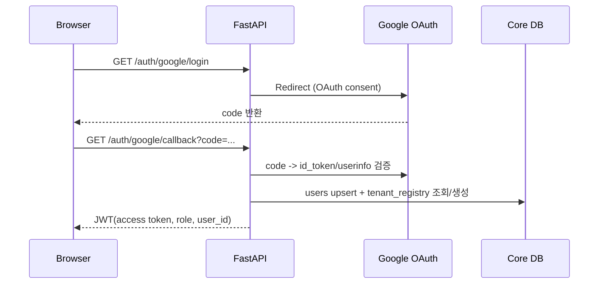

# Google 회원가입 + 멀티테넌트(MVP) 구조도

## 목표
- 회원가입/로그인을 Google OAuth로 처리
- 회원별 데이터 분리(테넌트 분리)
- 관리자 계정은 전체 테넌트 모니터링/감독 가능
- 기존 댓글 분석 파이프라인은 최대한 재사용

---

## 1) 전체 구조 (High-Level)

```mermaid
flowchart TB
    U[User Browser] --> API[FastAPI]
    A[Admin Browser] --> API

    API --> AUTH[Auth Service\nGoogle OAuth + JWT]
    API --> TENANT[Tenant Router Service\nuser_id -> tenant DB]
    API --> PIPE[Comment Analysis Pipeline\n(기존 로직 재사용)]
    API --> ADM[Admin Service]

    AUTH --> CORE[(Core DB)]
    TENANT --> CORE
    ADM --> CORE

    TENANT --> TDB1[(Tenant DB: user_1)]
    TENANT --> TDB2[(Tenant DB: user_2)]
    TENANT --> TDBN[(Tenant DB: user_n)]

    PIPE --> TDB1
    PIPE --> TDB2
    PIPE --> TDBN
```

---

## 2) 프로젝트 폴더 구조 제안 (MVP)

```text
Moabom_Prototype/
├─ scripts/
│  ├─ api/
│  │  ├─ auth.py              # Google 로그인/콜백, 토큰 발급
│  │  ├─ admin.py             # 관리자 전용 API
│  │  ├─ products.py
│  │  ├─ sync.py              # 기존 sync (tenant connection 사용으로 변경)
│  │  └─ videos.py
│  │
│  ├─ services/
│  │  ├─ auth_service.py      # Google ID token 검증, JWT 생성
│  │  ├─ tenant_service.py    # user -> tenant DB 매핑/연결
│  │  ├─ admin_service.py     # 전체 사용자/테넌트/작업 모니터링
│  │  └─ provisioning_service.py # 신규 사용자용 tenant DB/schema 생성
│  │
│  ├─ database/
│  │  ├─ core_connection.py   # Core DB 연결
│  │  ├─ tenant_connection.py # Tenant DB 연결
│  │  ├─ core_schema.py       # users, tenant_registry, audit_logs
│  │  └─ tenant_schema.py     # 기존 분석 테이블 세트
│  │
│  └─ middleware/
│     ├─ auth_middleware.py   # JWT 인증
│     └─ tenant_context.py    # request에 tenant context 주입
│
├─ comment_filtering_agent/   # 기존 유지
└─ main_youtube_tech_review.py
```

---

## 3) DB 분리 전략 (MVP 권장안)

## 옵션 A: DB per user (완전 분리)
- 사용자마다 DB 하나 생성: `moabom_tenant_<user_id>`
- 장점: 격리 강함, 백업/복구 단위 명확
- 단점: 운영 복잡도 증가

## 옵션 B: Schema per user (MVP 추천)
- 하나의 PostgreSQL DB 안에 스키마 분리: `tenant_<user_id>`
- 장점: 운영 간단, 격리 충분, 마이그레이션 용이
- 단점: 초대형 트래픽에서 추가 설계 필요

MVP에서는 **Schema per user** 추천.

---

## 4) Core DB 테이블 (공용)

```sql
-- 사용자
users (
  id                BIGSERIAL PRIMARY KEY,
  email             VARCHAR(255) UNIQUE NOT NULL,
  name              VARCHAR(255),
  google_sub        VARCHAR(255) UNIQUE NOT NULL, -- Google 고유 식별자
  role              VARCHAR(20) NOT NULL DEFAULT 'user', -- user/admin
  is_active         BOOLEAN NOT NULL DEFAULT TRUE,
  created_at        TIMESTAMP DEFAULT NOW(),
  last_login_at     TIMESTAMP
);

-- 테넌트 매핑
tenant_registry (
  user_id           BIGINT PRIMARY KEY REFERENCES users(id) ON DELETE CASCADE,
  tenant_key        VARCHAR(100) UNIQUE NOT NULL, -- e.g., tenant_42
  db_name           VARCHAR(100),                 -- DB per user 시 사용
  schema_name       VARCHAR(100),                 -- Schema per user 시 사용
  status            VARCHAR(20) NOT NULL DEFAULT 'active',
  created_at        TIMESTAMP DEFAULT NOW()
);

-- 감사 로그
audit_logs (
  id                BIGSERIAL PRIMARY KEY,
  actor_user_id     BIGINT REFERENCES users(id),
  actor_role        VARCHAR(20),
  action            VARCHAR(100) NOT NULL, -- login, sync_start, admin_view_user 등
  target            VARCHAR(255),
  metadata          JSONB,
  created_at        TIMESTAMP DEFAULT NOW()
);
```

---

## 5) Tenant 데이터 구조

각 tenant(schema or DB)에 기존 분석 테이블 세트를 그대로 둠:

- tech_products
- videos
- comments
- comment_sentiments
- video_transcripts
- video_reports
- (agent 중간 테이블) rule_filter_results, llm_classifications, agent_decisions, aspect_extractions ...

즉, 현재 파이프라인 로직은 “연결만 tenant별로 바꿔서” 재사용.

---

## 6) 인증/인가 플로우 (Google)



JWT claims 예:
- `sub`: 내부 user_id
- `role`: user | admin
- `tenant_key`: tenant_42

---

## 7) 요청 처리 플로우 (일반 사용자)

1. JWT 인증
2. `tenant_service`가 `tenant_key` 확인
3. 해당 tenant connection/schema로 DB 세션 바인딩
4. 기존 `/sync`, `/videos`, `/reports` 로직 실행
5. 결과는 내 tenant 데이터에만 저장/조회

---

## 7-1) 데이터 접근 격리 원칙 (중요)

- **로그인한 계정은 본인 tenant DB/schema만 접근 가능**
- 다른 사용자 tenant로의 쿼리는 애플리케이션 레벨에서 차단
- 관리자만 예외적으로 cross-tenant 조회 가능 (기본은 read-only 권장)

강제 규칙:
1. 모든 API는 JWT의 `user_id`, `tenant_key`를 기준으로 DB 세션 바인딩
2. API 파라미터로 `tenant_key`, `user_id`를 직접 받지 않음 (위변조 방지)
3. `products/sync/videos/reports` 포함 **모든 쿼리**는 tenant context 기반으로 실행
4. tenant context 없는 요청은 401/403 처리

즉, 이 구조를 적용하면 기존 코드도 아래처럼 전면 수정이 필요:
- 전역 `DATABASE_URL` 직접 사용 코드 제거
- `query_one/query_all/execute_*`에 tenant-aware connection 주입
- 라우트 핸들러에서 tenant context 생성/전달
- background task/scheduler도 tenant 단위로 실행되게 분리

---

## 7-2) 코드 전면 수정 범위 (필수)

멀티테넌트 격리를 진짜로 보장하려면 아래 영역을 모두 수정해야 함:

1. **DB 연결 계층**
   - `scripts/database/connection.py`
   - `scripts/database/queries.py`
   - 목적: tenant별 connection/session 획득 방식으로 변경

2. **API 라우트 전반**
   - `scripts/api/products.py`
   - `scripts/api/sync.py`
   - `scripts/api/videos.py`
   - 목적: 모든 조회/저장을 tenant context 기반으로 실행

3. **서비스 계층**
   - `scripts/youtube/*`
   - `scripts/reports/*`
   - `comment_filtering_agent` 저장 로직
   - 목적: DB write/read 시 tenant session 사용

4. **미들웨어/인증**
   - JWT 검증 후 request.state에 `user_id`, `tenant_key`, `role` 주입
   - role guard(user/admin) 공통화

5. **관리자 기능**
   - admin 전용 엔드포인트에서만 cross-tenant 접근 허용
   - 감사 로그(audit_logs) 기록 의무화

---

## 8) 관리자 계정 플로우

관리자(`role=admin`)는 Core DB 기준으로:
- 전체 사용자 목록 조회
- 사용자별 tenant 상태 확인
- 사용자별 sync 이력/오류율 모니터링
- 특정 tenant read-only 조회(필요 시)

관리자 전용 API 예:
- `GET /admin/users`
- `GET /admin/tenants`
- `GET /admin/users/{user_id}/stats`
- `GET /admin/audit-logs`

---

## 9) MVP 구현 순서

1. Core DB 스키마 추가 (`users`, `tenant_registry`, `audit_logs`)
2. Google OAuth 로그인/콜백 API 구현
3. JWT 미들웨어 + role 체크
4. tenant provisioning (첫 로그인 시 schema 생성)
5. tenant connection router 적용
6. 기존 sync/videos 쿼리 실행 컨텍스트를 tenant로 전환
7. admin API 최소셋 구현

---

## 10) MVP 운영 체크포인트

- OAuth redirect URI 정확히 등록
- JWT 만료/재발급 정책
- tenant schema 생성 실패 시 롤백
- admin API는 반드시 role guard 적용
- audit_logs 최소한 로그인/관리자 조회/동기화 이벤트 기록

---

## 결론

MVP에서는 **Google OAuth + Schema-per-user + 관리자 read-heavy 감독 구조**가
가장 단순하고 안전하게 시작하기 좋음.

기존 분석 파이프라인은 그대로 두고, “DB 연결 컨텍스트”만 tenant별로 바꾸는 방식이
개발 리스크와 변경 범위를 최소화함.
