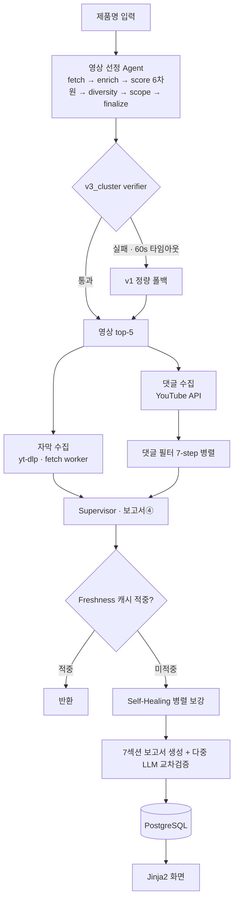

# Moabom
> 멀티에이전트 테크 제품 리뷰 분석 서비스


---

## 🎯 프로젝트 소개

**한 제품에 대한 여러 유튜브 테크 리뷰 영상의 자막과 댓글을 자동 수집·분석해, 리뷰어들의 합의 의견(합의 빈도 N/N)과 실사용자 여론을 함께 담은 제품 단위 7섹션 종합 보고서를 생성하는 B2C 웹 MVP.** 인하대학교 AI공학과 캡스톤 3인 프로젝트.

리뷰 영상 하나하나를 직접 보고 댓글을 훑는 대신, 제품명 하나만 입력하면 여러 리뷰어의 판단이 얼마나 일치하는지와 실사용자 반응을 한 화면에서 확인한다.

- 🤖 **멀티에이전트 파이프라인**: 영상 선정 · 댓글 필터 · 보고서 생성 3개 에이전트(LangGraph)
- 📊 **판정 일관성 98%**: 300회 실행 기준(GPT-4.1 90%, Gemini 86% 대비)
- 💸 **로컬 KLUE-RoBERTa 증류로 댓글 분류 API 비용 99% 절감, 추론 속도 22배**(macro F1 0.917)
- 🎬 **비교 영상 자동 제외**: 탐지 정확도 0.899(데스크탑 GPU 워커)
- 🚀 **Azure Container Apps 실배포**: v1 MVP(2026.5.13~5.19) MAU 97, 설문 13명 회수 후 v2 개선

---

## ✨ 주요 기능

### 🎬 영상 선정 Agent (`video_selection_agent/`, LangGraph StateGraph)
- ✅ 제품 키워드로 YouTube 후보 30개(pool) 수집
- ✅ 6차원 정량 점수화: engagement · recency · channel_bias · duration · relevance + 가중치
- ✅ 다양성 필터 + `scope_filter`로 비교 영상(여러 제품 동시 비교) 자동 제외
- ✅ 기본 전략 `v3_cluster`: coarse-to-fine 클러스터링(Qwen3-Embedding-4B 워커 + KMeans), fine 단계에서 `llm_final_select` + 결정적 verifier
- ✅ 60초 타임아웃·실패 시 `v1` 정량 폴백, `auto` 단일 경로 k=5

### 💬 댓글 필터링 Agent (`comment_filtering_agent/`, 7-step)
- ✅ 수집 → 전처리 → 12종 룰 소프트 필터 → Top 300 → 6기준 Multi-Criteria → LLM 5-class 분류 → AgentDecisionEngine + ABSA 감성
- ✅ 5-class: `PRODUCT_OPINION` / `QUESTION` / `VIDEO_REACTION` / `CHATTER` / `OFF_TOPIC`
- ✅ AgentDecisionEngine 판정: `ANALYZE` / `AUXILIARY_STORE` / `EXCLUDE` / `HOLD` / `RECLASSIFY`
- ✅ 영상 단위 `ThreadPoolExecutor` 병렬 처리

### 📄 보고서 생성 (`scripts/reports/`, 4단계 누적)
- ✅ ① 영상별 자막 → ② 영상별 댓글 → ③ 영상별 통합 → ④ 제품 단위 7섹션 종합
- ✅ 환각 방지 4규칙 적용
- ✅ 4종 보고서 다중 LLM 교차검증(`_verification.py`): 생성 → 코드 게이트 → 별도 LLM 비평 → 수정
- ✅ 임베딩 의미 검색 재정렬(`scripts/rag/`), 제품 이미지 검증(Serper + 비전 LLM)

### ☁️ 배포·운영
- ✅ Azure Container Apps + GitHub Actions CI/CD: 회귀 게이트 → ACR 빌드 → 배포 → 헬스체크
- ✅ 하이브리드 fetch worker: residential IP(데스크탑)에서 자막 fetch·scope 분류·임베딩을 위임해 datacenter IP 봇 차단을 우회
- ✅ DB 캐시로 동일 제품 재요청은 2초 내 응답, 자막은 영구 캐시

---

## 🛠 기술 스택

| 구분 | 기술 |
|---|---|
| **Backend** | FastAPI 0.104.1, Uvicorn 0.24.0, Pydantic |
| **Frontend** | Jinja2 3.1.2 + Vanilla JS + Markdown 렌더링 (React/TS 미적용) |
| **DB** | PostgreSQL 15, psycopg2-binary, Schema Auto-init (19 테이블) |
| **AI·LLM** | RunYourAI 게이트웨이(`gpt-4.1-2025-04-14`), langchain-openai, LangGraph 0.2+, anthropic |
| **데이터 수집** | YouTube Data API v3, youtube-transcript-api 0.6.1, yt-dlp |
| **임베딩·검색** | text-embedding-3-small, stdlib `sqlite3`, 순수 파이썬 코사인 유사도 (벡터DB 미사용) |
| **ML 보조** | klue/roberta-large(별도 학습 repo), scikit-learn KMeans, Qwen3-Embedding-4B(GPU 워커: torch / transformers / sentence-transformers) |
| **검색** | Serper |
| **Infra** | Azure Container Apps, Azure PostgreSQL Flexible, ACR, Log Analytics, Docker |
| **테스트** | pytest 회귀(`regression/`, 45 tests) |

---

## 📁 프로젝트 구조

```
moabom/
├── main.py                       # FastAPI 진입점
├── scripts/                      # 핵심 파이프라인 모듈
│   ├── config · api · database   # 설정 · 라우터 · DB
│   ├── youtube · analysis · llm  # 수집 · 분석 · LLM 호출
│   ├── reports/                  # 보고서 4단계 생성 + 다중 LLM 교차검증
│   ├── rag/                      # 임베딩 청킹 · sqlite3 저장 · 코사인 재정렬
│   ├── product_image/            # 제품 이미지 검증 (Serper + 비전 LLM)
│   └── popup · tracking · utils
├── orchestrator/                 # 보고서④ Supervisor (freshness · graph · runner)
├── video_selection_agent/        # 영상 선정 Agent
│   └── graph(nodes) · scoring · clustering · scope_filter · activation
├── comment_filtering_agent/      # 댓글 필터링 Agent
│   └── filters · classifiers · analyzers · core
├── services/fetch_worker/        # 하이브리드 워커 (FastAPI): /transcript /scope-classify /embed /classify
├── regression/                   # pytest 회귀 (45 tests)
├── templates/ · static/          # Jinja2 화면
├── data/comment_labels/          # 댓글 라벨 6,375건
├── .github/workflows/deploy.yml  # CI/CD
└── Dockerfile · docker-compose.yml
```

---

## 🏗 아키텍처 / 동작 흐름



**핵심 구조 포인트**

- **멀티에이전트 = 부분 Supervisor 구조.** 영상 선정은 독립 라우트로 돌고, Supervisor(LangGraph)는 보고서④ 경로만 오케스트레이션한다.
- **분기는 규칙 기반(결정론적).** LLM은 전문 노드 내부에서만 호출하고, 흐름 제어는 규칙이 담당한다. 재현성과 디버깅 가능성을 확보하기 위한 선택이다.
- **langgraph 미설치 시 `FallbackLinearGraph`로 동작.** 그래프 런타임 부재를 견딘다.
- **영상 선정 그래프는 6노드.** LLM Re-rank·rationale 노드는 PR4에서 제거해 결정적 verifier 중심으로 정리했다.
- **Self-Healing.** 자막 없는 영상은 fetch 후 UPSERT, `agent_decisions`가 없는 영상은 댓글 Agent로 보강한다. `asyncio.gather`로 병렬·격리 실행한다.

---

## 🔌 API 개요

| Method | Endpoint | 설명 |
|---|---|---|
| GET | `/` | 메인 |
| GET | `/products` | 제품 목록 |
| GET | `/products/suggest` | 제품명 제안 |
| POST | `/products` | 제품 등록 |
| GET / DELETE | `/products/{id}` | 조회 · 삭제 |
| POST | `/products/{id}/image` | 제품 이미지 검증 |
| POST | `/products/{id}/integrated-insight` | 보고서④ 생성 (Supervisor, `force` 재생성) |
| POST | `/products/{id}/select-videos` | 영상 선정 (동기) |
| GET | `/products/{id}/select-videos/progress` | 진행 폴링 |
| GET | `/products/{id}/selection-runs/{run_id}` | 선정 실행 결과 |

이 외 video · sync · admin 라우터. 미들웨어: UTF-8, GA, UsageTracking. 회원 인증은 미구현(Google OAuth 예정).

---

## 📋 핵심 기능 상세

### 멀티에이전트 파이프라인
영상 선정은 6차원 정량 점수와 `v3_cluster` 클러스터링으로, 댓글 필터는 LLM 5-class 분류와 12종 룰 소프트 필터로 구성한다. 두 에이전트가 만든 결과를 보고서 생성 단계가 4단계 누적으로 통합한다.

### KLUE-RoBERTa 증류로 댓글 분류 비용 절감
교사 모델(GPT-4.1)이 라벨링한 댓글 6,375건으로 `klue/roberta-large`를 증류했다. macro F1 0.917, 추론 속도 22배, 댓글 분류 API 비용 99% 절감. 워커의 `/classify` 엔드포인트로 구현했고 운영 통합은 대기 중이다. 매 요청마다 LLM을 호출하던 분류 단계를 로컬 모델로 대체해 대량 댓글 처리 비용을 상수로 낮췄다.

### 다중 LLM 교차검증
보고서 생성 → 코드 게이트 → 별도 LLM 비평 → 수정의 4단계로 환각을 통제한다. 환각 방지 4규칙을 적용하고, 4종 보고서에 교차검증을 건다. 생성 모델과 비평 모델을 분리해 자기 검증의 사각지대를 줄였다.

### Self-Healing
자막이 없는 영상은 fetch 후 UPSERT, `agent_decisions`가 비어 있는 영상은 댓글 Agent로 다시 채운다. `asyncio.gather`로 병렬 실행하되 각 보강 작업을 격리해 하나가 실패해도 나머지 보고서 생성이 진행된다.

### 임베딩 의미 검색 (벡터DB 미사용)
`chunker` → `embedder`(text-embedding-3-small, batch 64, `content_hash` 캐시) → `store`(sqlite3에 JSON 직렬화 저장) → `retriever`로 이어진다. retriever는 12개 측면 쿼리를 임베딩한 뒤 **순수 파이썬 코사인 유사도**로 재정렬하고, 길이 상한을 넘으면 하위 항목을 제외한다. faiss·pgvector는 쓰지 않는다. pgvector는 `CREATE EXTENSION` 실패로 SQLite 폴백을 택했다.

---

## 📊 성과 · 정량 지표

| 지표 | 값 | 근거 |
|---|---|---|
| 판정 일관성 | **98%** | 300 run(10제품 × 10반복 × 3모델), GPT-4.1 90% · Gemini 86% 대비 |
| 댓글 분류 | **macro F1 0.917** | KLUE-RoBERTa 증류 모델 |
| 비교 영상 탐지 | **0.899** | scope 분류 정확도 |
| 추론 속도 · 비용 | **22배 / 99% 절감** | 로컬 증류 모델 대체 (댓글 분류) |
| 실사용 | **MAU 97** | v1 MVP 2026.5.13~5.19, 설문 13명 회수 → v2 개선 |
| 회귀 테스트 | **45 tests** | `regression/` |
| 학습 데이터 | **6,375건** | 댓글 라벨(`data/comment_labels/`) |

---

## 👤 팀 · 역할

인하대학교 AI공학과 캡스톤 3인 프로젝트.

| 이름 | 역할 | 담당 |
|---|---|---|
| **김재현** (AI/Data Engineer) | 백엔드 · 데이터 | 백엔드 아키텍처, DB 설계(19테이블), 댓글 필터링 Agent, 댓글 분류 KLUE-RoBERTa 증류(개인 레포) |
| **김유현** (팀장) | 설계 · 프론트 · 영상 | 전체 설계, UI/UX, 영상 선정 Agent, scope-classifier |
| **한상민** | 보고서 · 검증 | 보고서 파이프라인, Self-Healing, 다중 LLM 검증 |

---

## 🐛 로컬 개발 / 실행

```bash
# 의존성 설치
pip install -r requirements.txt

# docker-compose로 실행 (app + PostgreSQL)
docker-compose up --build

# 또는 직접 실행
uvicorn main:app --reload
```

환경변수(`scripts/config`)는 YouTube Data API v3 키, RunYourAI 게이트웨이 키, PostgreSQL 접속 정보, Serper 키를 사용한다. 실제 키 값은 레포에 포함하지 않는다. GPU 워커(Qwen3-Embedding, KLUE 분류)는 데스크탑 환경에서 `services/fetch_worker`로 기동한다.
