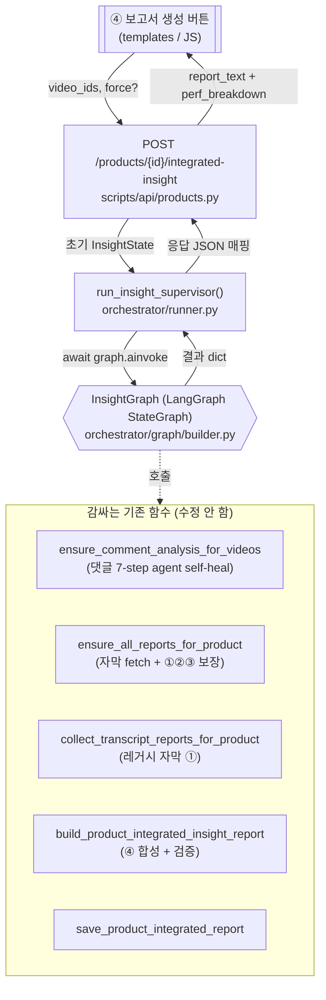
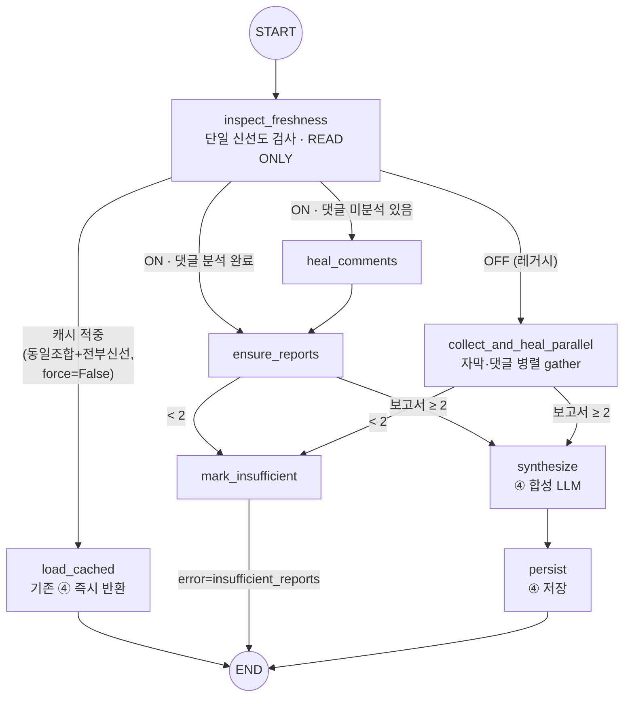
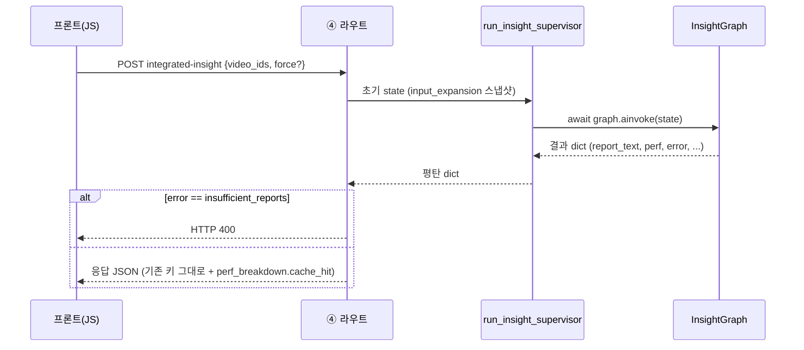
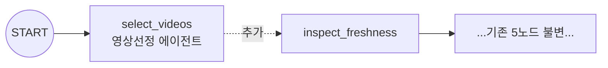

# 통합보고서 Supervisor 오케스트레이터 설계

> 모아봄의 3개 에이전트(영상선정 / 댓글필터 / 보고서)를 **LangGraph Supervisor**로 지휘하고,
> 흩어져 있던 "DB 캐시냐 새로 fetch냐" 판단을 **단일 Freshness 정책**으로 통합한 오케스트레이션 레이어.
> 범위는 **④ 제품 단위 통합 인사이트 보고서** 경로 (`POST /products/{id}/integrated-insight`).

---

## 1. 왜 만들었나

기존에는 ④ 라우트가 self-healing 함수들을 직접 `if/else` + `asyncio.gather`로 엮었고,
"이미 DB에 있나(캐시) / 없나(fetch)" 판단이 함수마다 따로 박혀 있었다.

| 문제 | 기존 | Supervisor 도입 후 |
|---|---|---|
| 오케스트레이션 주체 | 라우트 핸들러가 직접 함수 호출 | **LangGraph StateGraph가 DAG로 지휘** |
| 캐시/fetch 판단 | `_videos_missing_transcript`, `_videos_with_existing_comment_analysis`, 보고서 내부캐시 — 산재 | **`freshness.py` 한 곳에 통합 (READ ONLY)** |
| 동일 입력 재요청 | 매번 ④ 재생성 + INSERT 누적 | **캐시 적중 시 기존 보고서 즉시 반환** (FR-020) |
| 확장성 | 라우트에 결합 | 노드 추가로 선정 에이전트 등 앞단 확장 가능 |

**불변 원칙**: 기존 에이전트 내부 구조·**YouTube API 호출은 일절 수정하지 않는다.** 전부
블랙박스 함수로만 감싼다(wrap). `orchestrator/`는 `scripts/youtube/*`·`sync.py`를 import하지 않는다.

---

## 2. 전체 구조도



> 위 함수들 **내부**에만 YouTube API / RunYourAI LLM 호출이 있다. Supervisor는 이들을 호출만 한다.

---

## 3. 그래프 흐름 (노드 + 라우팅)



### 라우팅 규칙

| 분기 함수 | 조건 | 다음 노드 |
|---|---|---|
| `route_after_freshness` | `force=False` & 캐시 적중 | `load_cached` |
| | OFF (`REPORT4_INPUT_EXPANSION=0`) | `collect_and_heal_parallel` |
| | ON & 모든 영상 댓글 분석 완료 | `ensure_reports` |
| | ON & 댓글 미분석 영상 존재 | `heal_comments` → `ensure_reports` |
| `route_after_reports` | 분석된 보고서 ≥ 2 | `synthesize` → `persist` |
| | < 2 | `mark_insufficient` (→ 라우트가 HTTP 400) |

### "캐시 적중" 판정 (`_cache_hit`)
모두 만족해야 기존 ④를 즉시 반환:
1. 동일 `video_ids` 조합으로 생성된 ④ 보고서 존재 (`prior_exact_match`)
2. 모든 영상 댓글 분석 완료 (⑤ 소비자 여론 집계용)
3. 자막 누락 없음
4. ④가 소비할 입력 신선:
   - **ON**: 모든 영상 ①②③ 보유 (`fully_reported`)
   - **OFF**: 모든 영상 ① (자막 보고서) 보유

---

## 4. Freshness 정책 — 캐시 vs fetch 통합 (`orchestrator/freshness.py`)

흩어져 있던 판단을 **한 번의 SELECT 묶음**으로 통합. **생성/수정 없음, READ ONLY**.

| 검사 항목 | 조회 테이블 | 의미 |
|---|---|---|
| 댓글 분석 유무 | `comments ⋈ agent_decisions` | 댓글 7-step agent 적재 여부 |
| 자막 유무 | `video_transcripts` | 자막 캐시 여부 |
| 보고서 ①②③ 유무 | `video_reports` (3컬럼) | 영상별 r1/r2/r3 bool |
| 동일 조합 ④ | `product_integrated_reports` | 정확 집합 일치 보고서 id |

> Freshness는 **자문(advisory)** 신호일 뿐, 실제 보강은 여전히 기존 idempotent 함수가 담당한다.
> (라우팅·관측·캐시 단축에만 사용 → 잘못 skip돼도 `ensure_all_reports`가 내부에서 self-heal.)

---

## 5. 노드 ↔ 감싸는 기존 함수 매핑

모든 노드는 `async`, `{**state, ...}` 전체 치환, sync 함수는 `asyncio.to_thread`로 래핑.

| 노드 | 호출 함수 (`scripts/reports/...`) | 산출 state 키 | LLM/YouTube |
|---|---|---|---|
| `inspect_freshness` | `orchestrator.freshness.inspect_freshness` | `freshness` | ❌ (SELECT만) |
| `load_cached` | `get_product_integrated_report` | `report_text, report_id, cache_hit` | ❌ |
| `heal_comments` | `ensure_comment_analysis_for_videos` | `comment_heal_stats` | ✅ (미분석분만) |
| `ensure_reports` | `ensure_all_reports_for_product` | `per_video_reports` | ✅ (누락분만) |
| `collect_and_heal_parallel` | `collect_transcript_reports_for_product` + `ensure_comment_analysis_for_videos` (gather) | `per_video_reports, comment_heal_stats` | ✅ (누락분만) |
| `synthesize` | `build_product_integrated_insight_report` | `report_text, model_used` | ✅ (④ 합성) |
| `persist` | `save_product_integrated_report` | `report_id` | ❌ |
| `mark_insufficient` | — | `error` | ❌ |

---

## 6. 상태 (`orchestrator/graph/state.py`)

`InsightState(TypedDict, total=False)` — `video_selection_agent`의 관례를 따른다 (reducer 없이 전체 치환).

```
입력      : product_id, product_name, video_ids, selected_video_count, force, input_expansion
검사 산출 : freshness (FreshnessReport)
보강 산출 : comment_heal_stats, per_video_reports, analyzed_video_ids, excluded_video_ids
합성 산출 : report_text, model_used, report_id, cache_hit
관측/제어 : perf{...}, error, trace[]
```

---

## 7. 라우트 연동 (`scripts/api/products.py`)



- 라우트는 **응답 JSON 키를 100% 보존**한다 (templates/JS 의존). `perf_breakdown`에 `cache_hit`만 추가.
- `total_ms`는 라우트가 계속 소유(의미 불변). `force`는 요청 body에서 선택 수용.

---

## 8. 장애 대비 (langgraph 미설치)

`build_insight_graph()`는 `from langgraph.graph import ...` 실패 시 **`_FallbackLinearGraph`** 반환
(영상선정 에이전트와 동일 패턴). 단, ④ 함수는 코루틴이므로 fallback은 **async `ainvoke`**를 노출하며,
동일 라우팅을 순수 파이썬으로 에뮬레이션한다. 로컬 개발(langgraph 미설치)은 fallback,
프로덕션(Azure, requirements 설치)은 실제 StateGraph로 동작 — 둘 다 `await graph.ainvoke(state)` 단일 호출부.

---

## 9. 저장소 구조

```
orchestrator/
├── __init__.py          # run_insight_supervisor, inspect_freshness 재노출
├── freshness.py         # 단일 신선도 검사 (READ ONLY DB SELECT)
├── runner.py            # run_insight_supervisor — 라우트 진입점
└── graph/
    ├── state.py         # InsightState TypedDict
    ├── nodes.py         # async 노드 (기존 함수 wrap)
    └── builder.py       # build_insight_graph() + _FallbackLinearGraph
```

수정한 기존 파일: **`scripts/api/products.py`의 ④ 라우트 한 곳뿐** (오케스트레이션 블록 → 단일 호출).

---

## 10. 향후 확장 (미구현)



`START → select_videos → inspect_freshness` 노드 1개만 prepend하면 영상선정 에이전트를 앞단에 통합
가능. 기존 5노드는 불변, `runner`에 `mode` 파라미터 추가 시 활성화.

---

## 참고
- [VIDEO_SELECTION_AGENT_DESIGN.md](VIDEO_SELECTION_AGENT_DESIGN.md) — 미러링한 LangGraph + fallback 패턴
- [COMMENT_FILTERING_AGENT_DESIGN.md](COMMENT_FILTERING_AGENT_DESIGN.md) — `heal_comments`가 감싸는 댓글 7-step agent
- `scripts/reports/product_integrated_insight.py` — 감싸는 self-healing 함수 본체
